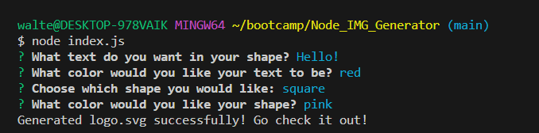

# Node_IMG_Generator
- Welcome to a demonstration of what coding with node.js and javascript is capable of! 

- Using inquirer to present easy to understand questions to users that they can then easily answer using the git-bash terminal.

- To get started, ensure you have inquirer installed. Open up your git-bash terminal and type in 'npm i'.

- Simply type into the terminal 'node index.js' and you are presented with the first of a series of questions. 

- Upon answering your question, you will be automatically presented with the next question. These questions will be asking you general information needed to create a new SVG logo! 

- Once all questions have been answered, you will receive a notification saying 'Generated logo.svg successfully! Go check it out!' 

- fs will then use the writeToFile() function to create a new logo.svg file ready for use complete with proper formatting and imagery. 

```
** ALSO, ensure you have installed jest properly for testing the application. 
** AFTER INSTALLING JEST, ensure you have this script added to your package.json file :  
 "scripts": {
  
    "test": "jest"
  },

** After you have your code for testing set up, simply type into the terminal "npm test" 

```

- Try it out!


## Acceptance Criteria 

- GIVEN a command-line application that accepts user input

- WHEN I am prompted for text, THEN I can enter up to three characters.

- WHEN I am prompted for the text color, THEN I can enter a color keyword (OR a hexadecimal number).

- WHEN I am prompted for a shape, THEN I am presented with a list of shapes to choose from: circle, triangle, and square.

- WHEN I am prompted for the shape's color, THEN I can enter a color keyword (OR a hexadecimal number).

- WHEN I have entered input for all the prompts, THEN an SVG file is created named `logo.svg` AND the output text "Generated logo.svg" is printed in the command line

- WHEN I open the `logo.svg` file in a browser, THEN I am shown a 300x200 pixel image that matches the criteria I entered.


## Link to demonstration of application:

https://youtu.be/rFDLZXHAsYk 


## Screenshot of SVG Logo: 




## Link to repository: 

https://github.com/waltscode/Node_IMG_Generator 


